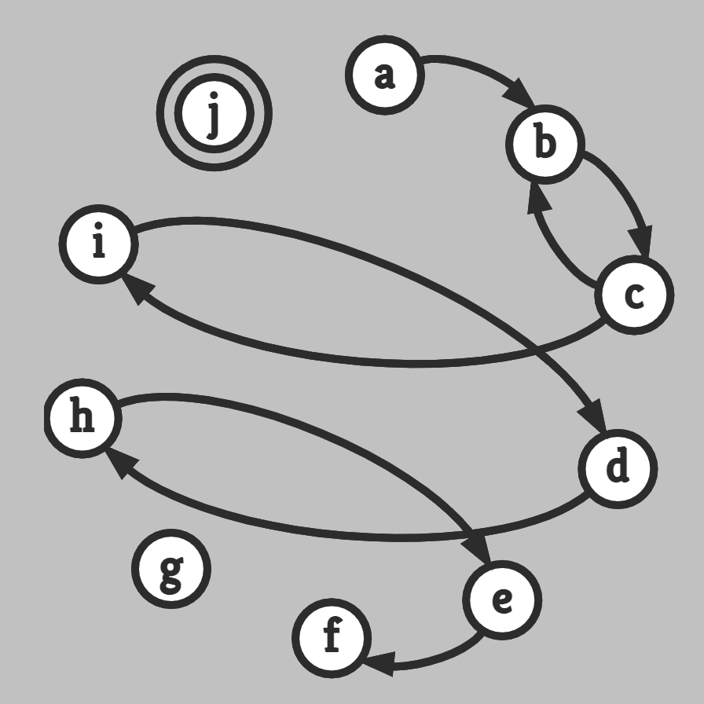

# [circuit-visualizer-p5](https://awillats.github.io/circuit-visualizer-p5/)

🚧  Work in progress 🚧   
Experimental visualizer for studying networks / graphs / circuits and properties of their adjacency matrices.
The big-picture goal for this project is to inform how best to stimulate neural circuits in order to infer their connectivity.

[Try demo:](https://awillats.github.io/circuit-visualizer-p5/)
- clicking the adjacency matrix
- moving nodes around (`m`)
- typing new circuits into the text field

# Keyboard Commands: ⌨️
## Editting modes
`n`: enter "add `n`ew edges" editing mode, click a node and drag to another to connect them, do the same again to remove an edge 
`m`: enter "`m`ove" mode, drag nodes to reposition them 
`o`: enter "`o`pen-loop stimulation mode", clicking on a node delivers stimulation  
## Display layers
`s`: toggle showing edges  
`r`: toggle showing indirect connections  
`w`: `w`iggle nodes, display outputs  

`x`: e`x`port graph to text field  
`<space>`: create a new random, sparse network 

# Completed Features:
    - graph import from text field
        - can use bidirectional arrows <->
        - and multi input multi output lines a,b,c<->d,e
    - graph export to text field
    - toggle directional edges! (with s)
    - highlight edges from a second adjacency matrix
    - basic binary matrix reps
    - can import connections from binary string (check order / convention)
    - can bitshift to "rotate connections"
    - can toggle connections via adj mat
    - can add connections via drag arrows
        - will also remove redundant connections!
    - clearMat()

## Similar Frameworks:
- [xcorr-visualzier-p5](https://github.com/awillats/xcorr-visualizer-p5)
    - improves on visualizing outputs of nodes
- [NetworkX](https://networkx.org/documentation/stable/auto_examples/index.html#javascript)
- [Gephi](https://youtu.be/371n3Ye9vVo)
    gephi network datasets, could be scanned for candidate networks to ID
    - https://github.com/gephi/gephi/wiki/Datasets
    - has lots of layout options, including "force atlats"
- Cytoscape
-----
# Early Findings: 🔍

closed-loop control of a node reveals a lot if
    node N has many (non-reciprocal) inputs

for two nodes A,B,

if corr(A,B) > th for both ctrl(A) and ctrl(B)
    A ⟷ B

chains contain both colliders and forks

reach(un(M)) is insufficient to predict correlation in forks

closed-loop control can eliminate colliders (by serving inputs to junction)
closed-loop control interrrupts chains

# Major Issues: 🐛
- [ ] all node creation functions reference global variables, this makes it difficult to extend

- [ ] signal propogation for correlation inspection is "too correlated"

# Feature Requests: 🌠
- [ ] should fork-shaped and collider shaped reachability be undirected?  
- [ ] calculate "passes through node X" reachability
    - [ ] this is like a ternary reachability i suppose!
    - [ ] and precursor for "what if condition"
- [~] split edge drawing and matrix highlights into 2 functions
    - dangerous because of semi-arbitrary visualization criteria  
- [ ] have data generation, but currently only works with pure sources
    - can't handle reciprocal nodes as upstream sources
    - probably depends on (cycle-compatible) topological sort for resolution  
- [ ] have adjacency measure as anonymous function that can be reused?
    or non-anonymous is fine too ...
- [ ] topological sort -> y position
- [ ] print to console control severance score!
    - [ ] just requires rowSum, colSum, matSum
- [x] visualize where we're controlling
    - diamond around node?
    - [x] used rotating circle segments
- [~] in / out degree quant & viz
    - should we color / size by 1st order degree?
    - or reachable degree?  
    - calculate betweenness?  
    - this helps build intuition for which points are good to intervene  
    - cytoscape scales nodes by total degree  
- [~] - actually! this phase propogation thing is what we want to do instead of reachability(Unidirect(M))  
    which doesn't identify "common cause" correlation  
- [~] after calculating reachability, topologically sort the network  
    - all "leftmost" nodes propogate their "phase" to all their children  
        - easy! all nodes with no in degree get their own phase  
    - maybe have intrinsic noise only move in Y dimension  
    - control only move in x direction  
    - then addition can cause correlation in both?  
    - wiggling should simply be a sum of all input wiggles?  
        - normalize by num inputs?
        - verify this is what's implemented
    - [ ] control sets phase to follow control oscillator?  

- [ x] calculate reachability (floyd warshall ??)
    - [x.] vis reachability (in adjMat only?)
        - [x] have direct connections
        - [x] can highlight Nth order connections
        - [F] can do offset connections to overlay multiple metrics
        - [ ] vis reachability with something directional!

    - [ ] system for drawing wiggly high order connections
        - "bouncing" arrows?
        - blob communities together?
            - metaballs :O
                - add edges to blobbables
                - subtract non-nodes and node-edges via distance field?
            - convex hull ?
        - offset connections?  
- [~] delete edges / nodes gracefully
    - for now just clear everything
- [~] visualize self-connection with loop arrow  
    - [x] using circle around node for now

# Bonus Features: 🎁
- [ ] nodes wiggle to show correlation :)
- [ ] visualize open-loop stim

- [ ] import-export adjacency
    in this format:  
        {a,b,c,d,e,f,g}  
        a→b  
        b→c,d  
        d→a  
        f⟷g    
    export  
        to matlab, python, (GML?) txt
- [ ] "mute/unmute" all inputs/outputs by toggling column / row in adjacency matrix
- [ ] nicer UI elements (with ControlP5)
- [~] viz multiple mats on one tile
- [~] highlight control-severed edges
    csev = m & !ctrl(m)
    overlay red Xs
- [ ] color nodes by community
    see: [Clustering and Community Detection in Directed Networks: A Survey](https://arxiv.org/pdf/1308.0971.pdf;)
- [ ] color nodes by K-means after force-directed layout?

- [ ] duplicate edge protection (have collection of children be Sets)

## Additional caveats: ⚠️

- the force distribution piece of this is a mess
    -  may want links to have forces act on them in future
    - could add "angular attractors", i.e. attract individual nodes to an angle from the center, for default ordering of nodes
- will connect "reachability" highlighting to matrix view
- have simple circuit generation lay nodes out in a static ring
- should one unified representation be managed (i.e. adjMat?)
    - or should the graph and adjmat simply be synced?

----------------------
## Additional Topics: 
- generally, should be leveraging graph theory more, for instance
    - idea of where to control can be tied back to "minimum cut" and "highly connected subgraphs"
    - maximal clique
- quantifying degree: 
    - in-degree (r)  
    - out-degree (b)  
    - betweenness (mediator - G) (more complicated)  

# Interesting Circuits: 🕸️ 
e->a->b->d  
c->b  

big fork:  
a->b->c->d  
a->j->i->h  

big collider:  
h->i->j->a  
d->c->b->a  

-----
a->j  
b->e  
c->e  
f->e,h,j  
g->g,h  
i->d  
j->c,e  
